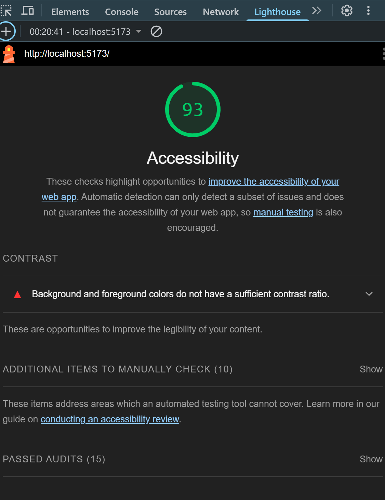

## Notes

1. Even though it is a small codebase, I designed the folder structure with scalability in mind to accommodate larger projects. Reusable Components and reusable hooks are segregated with the same consideration.

2. Unit tests have been implemented for most components, and I’ve aimed to cover as many scenarios as possible. However, it lacks the organization of mock data into separate files and some complex test cases. For purely structural components, snapshot testing has been utilized.

3. Comments have not yet been added, though I usually include them to enhance readability and provide future reference in larger codebases. There are also some typos in the commit messages and possibly in variable names.

4. I avoided using Redux and the Redux pattern to save time and ensure the project was completed on schedule.

5. I prioritized accessibility by using semantic elements for headers, main content, and other native components, minimizing the use of generic divs. Although I couldn’t test with screen readers due to a lack of tools, I checked the Lighthouse score, which was positive. It did flag some contrast issues between text and background, where I took a few liberties for this small application.

    

## Execute following commands in sequence to run the application

-   npm install
-   npm run json-server (port 8080 and endpoint http://localhost:8080/hotels)
-   npm run dev (app will run on http://localhost:5173)

## Following command to run test cases

-   npm run test

## Additional libraries and their uses

-   Vite library is used to create the project's initial setup
-   json-server : To run light weight server for named end points in the data/data.json (I have changed an object name in the given data file for a better end point name)
-   styled-components: For easier styling based on flex box and closer to JSX syntax
-   fontAwesom: used for icons used in ratings
-   vitest, react testing library, and other related libraries: to enable unit testing
